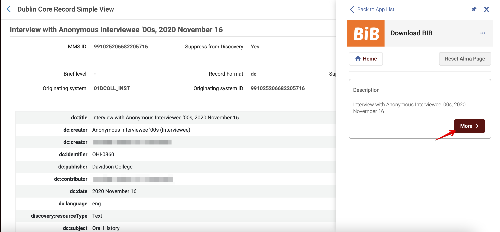

# Dublin Core XML Transformation into Preservica-ready XML

- [XSLT Code](#xslt-code)
- [How to Obtain the DC XML Record](#how-to-obtain-the-dc-xml-record)

## Davidson College Context

Alma exports the .xml file with a `<record>` tag and Preservica needs the `<oai_dc:dc>` tag. The Alma DC record also comes with a `<discovery:resourceType>` tag that isn't allowed in Preservica.

### XSLT Code

The following xslt transforms the xml into the right format for ingest into Preservica:

```xslt
<xsl:stylesheet version="2.0"
  xsi:schemaLocation="http://www.openarchives.org/OAI/2.0/oai_dc/ oai_dc.xsd"
  xmlns:xsl="http://www.w3.org/1999/XSL/Transform"
  xmlns:dc="http://purl.org/dc/elements/1.1/"
  xmlns:oai_dc="http://www.openarchives.org/OAI/2.0/oai_dc/"
  xmlns:xsi="http://www.w3.org/2001/XMLSchema-instance"
  xmlns:discovery="http://purl.org/dc/elements/1.1/">
  <xsl:output method="xml" version="1.0" encoding="UTF-8" indent="yes"/>
  <xsl:strip-space elements="*"/>

  <xsl:template match="node()|@*">
    <xsl:copy>
      <xsl:apply-templates select="node()|@*"/>
    </xsl:copy>
  </xsl:template>
  <xsl:template match="discovery:resourceType">
    <xsl:apply-templates/>
  </xsl:template>
  <xsl:template match="record">
    <oai_dc:dc>
      <xsl:apply-templates/>
    </oai_dc:dc>
  </xsl:template>
</xsl:stylesheet>
```

### How to Obtain the DC XML Record

The DC XML file is obtained through the ["Download BIB" Cloud Apps in Alma](https://developers.exlibrisgroup.com/blog/how-to-install-and-use-the-download-bib-cloud-app/).


