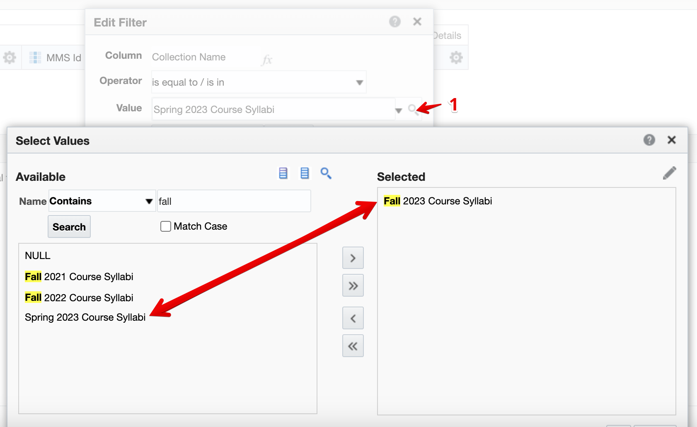
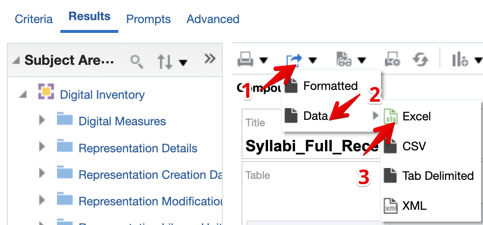

# Syllabi Process Configuration

## Davidson College Library Context

These procedures include 1. what needs to be done before the start a new term in Alma, 2. how to process deposit approvals, and 3. some configuration notes.

- [Syllabi Process Configuration](#syllabi-process-configuration)
  - [Davidson College Library Context](#davidson-college-library-context)
    - [Prep Before Term Starts](#prep-before-term-starts)
      - [Add the New Sub Collection](#add-the-new-sub-collection)
      - [Create and Attach a New Thumbnail to Sub-collection](#create-and-attach-a-new-thumbnail-to-sub-collection)
      - [Update Default Collection in Deposit Profile](#update-default-collection-in-deposit-profile)
      - [Remove Deposit Form from Previous Term's Collection](#remove-deposit-form-from-previous-terms-collection)
      - [Select Deposit Form in New Term's Sub-collection](#select-deposit-form-in-new-terms-sub-collection)
      - [Update dcterms:dateSubmitted](#update-dctermsdatesubmitted)
    - [Running Reports](#running-reports)
      - [Edit Report in Alma Analytics](#edit-report-in-alma-analytics)
    - [Approval Process](#approval-process)
    - [Configuration Notes](#configuration-notes)
      - [Deposit Form](#deposit-form)
      - [Access Rights](#access-rights)

### Prep Before Term Starts

There are a few steps that need to be taken before the semester starts and syllabi are deposited. First, a new sub-collection needs to be created under the "Davidson College Scholarship" top-level folder following the path Resources/Manage Inventory/Manage Collections. Then you need to create a thumbnail in Canva to display in Digital Davidson. Then you need to update the Deposit Profile to default to the new term's sub-collection. Then you need to remove the deposit form from the previous term. Finally, you need to add the deposit profile in the new term's sub-collection.

#### Add the New Sub Collection

*Add New Collection*  

Navigate to Davidson College Scholarship/Course Syllabi and add a new sub-collection for the next term.

*Add New Sub Collection for Term*  

Fill out the general information with the current term and basic description (which does show in Digital Davidson).

*Fill out new sub-collection info*  
Once a new collection has been added, you need to update the deposit profile to the new term and remove the deposit form from the previous term's collection.

#### Create and Attach a New Thumbnail to Sub-collection

Log in to Canva with the shared Library account. Search for "Syllabi Thumbnail Alma Digital" project. Edit the text for the new term. Then download at the lowest quality and compress it further since Alma has a low max size for thumbnails.

*Create a new thumbnail in Canva*  

Attach the thumbnail `.png` under the new sub-collection's General tab and Save.

*Attach and save thumbnail to sub-collection*  

#### Update Default Collection in Deposit Profile

Navigate to the Resources/Deposit/Manage Deposit Profiles

*Update Default Collection in Deposit Profile*  

Select the "Submit your Syllabus Here" profile

*Edit Syllabus Deposit Profile*  

Under "Post-submission Record Processing" click the `X` then search and select the new term's sub-collection. Finally click Save.

*Default sub-collection in deposit profile*  

#### Remove Deposit Form from Previous Term's Collection

Now you need to remove the deposit profile from the previous sub-collection just to make sure new deposits are collected in the new term's sub-collection. Select the null/blank option from the dropdown.

*Remove Deposit form from previous term collection*  

#### Select Deposit Form in New Term's Sub-collection

Finally, you need to add the deposit profile in the new term's sub-collection. After selecting the "Patron_Syllabi_Deposit_Form" make sure to save.

*Select deposit form for new sub-collection*  

#### Update dcterms:dateSubmitted

The date submitted is a hidden field that needs to be set up each term before deposits start coming in. How to get there is covered below in [Deposit Form config](#deposit-form).

*Edit Date Submitted*  

Change the "dcterms:dateSubmitted (dcterms:Period)" value to the current term, e.g., Fall 2023.

*Change Date Value*

### Running Reports

#### Edit Report in Alma Analytics

Open Alma Analytics > Catalog > Davidson College > Reports > Alma Digital >"Syllabi_Full_Received_List"

*Edit Report*  

Select the Criteria tab to change the collection filter.

*Edit Collection Filter*  

Swap the collection on the right with the one you want, e.g., Spring 2023 with Fall 2023.

*Swap Collections for Filter*  

Click Ok twice to accept the filter. Then Select the Results tab to view the table. Export as Excel.

*Export Data to Excel*  

Now you can drop that in Google Drive and share with whomever.

### Approval Process

The approval process is documented in a separate, but related, [GitBook](https://davidson-library.gitbook.io/systems-documentation/alma-digital/syllabi).

### Configuration Notes

#### Deposit Form

Deposit forms for Syllabi are under Configuration/Resources/Cataloging/Metadata Configuration

*Configuration Menu for Forms*  

Select Qualified Dublin Core

*Qualified Dublin Core*  

Select the Forms tab then the Syllabi_Patron_Deposit_Form

*Syllabi Deposit Form*  

#### Access Rights

The various access rights policies are configured under Configuration/Fulfillment/Copyright Management/Access Rights

*Access Rights Policy List*  
