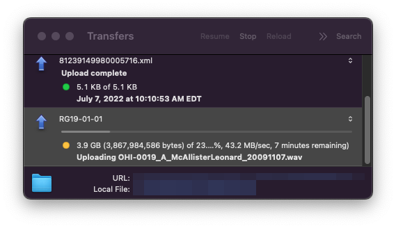
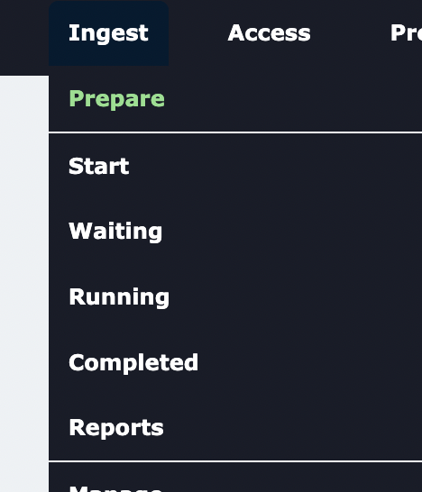
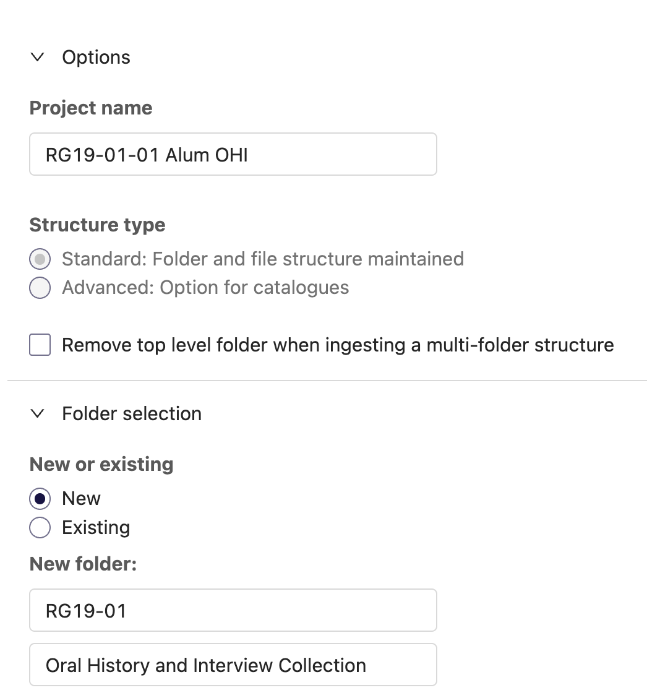
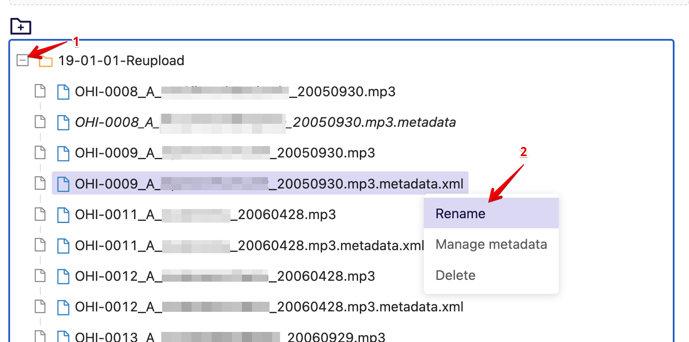
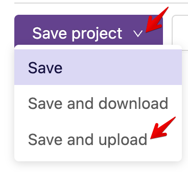
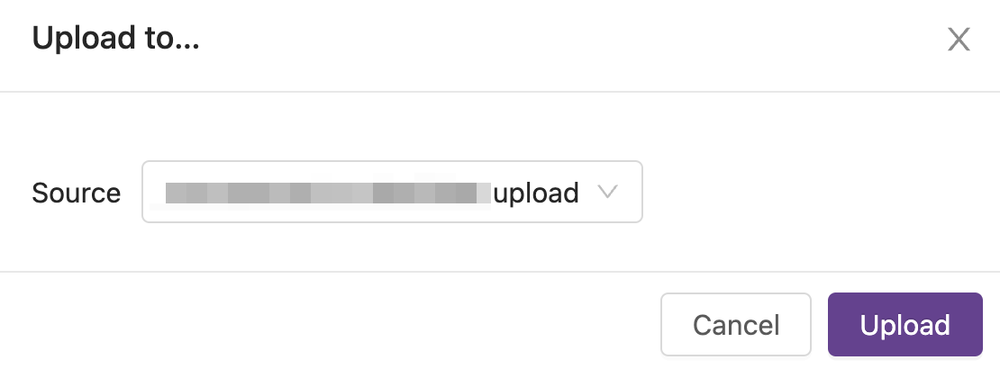

# Ingest Files along with Metadata into Preservica

Now that the metadata files are renamed and matched with the media file names, we can bulk ingest all files into Preservica. The Library chose to use [CyberDuck](https://cyberduck.io/) as our SFTP client since it's on both Mac and Windows. We chose to use an SFTP client because our projects go above the ~4GB upload limit of most browsers.

Drag the local/networked folder of metadata and media into the Preservica holding area.

Back in Preservica, click Ingest/Prepare to open the Holding Area where you will now find the folder you uploaded with Cyberduck.

In the Access holding area, select the folder and press "Move." This will ask you to create and save a project for the ingest.

Fill in the project name, select the folder where the media will be stored, and save the project (don't save and upload yet)

Click on the **+** to expand the folder view. You will notice that the .metadata files are in *italics* (which is what we want) but even with the file renaming in the previous section, some `.xml` are hidden in the file explorer/finder but show up in the Preservica folder view. We need to remove all `.xml` from the `.metadata.xml` files. Select one of the `.metadata.xml` files and right-click to rename the file name to only `.metadata`.

Once all the files have been renamed (again), you can "Save and upload"

Confirm the upload.

This is another opportunity for a :coffee:, :tea:, and/or a 🙆‍♀️ as it will take a while to create the ingest job.

Back on the Ingest/Running page, you should see the job that's been created. Click on the word "Ingest" to view the status and steps.
